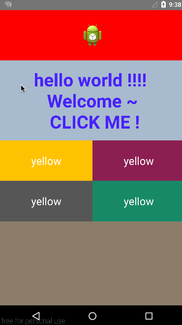
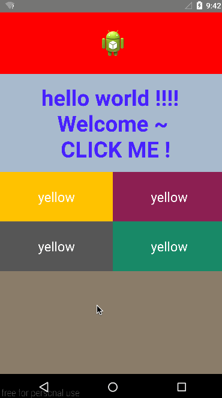

# WaveCompat
Wave effect of activity animation




# How to use
### 1. Bind wave touch helper to a view which will start an activity when it clicked:
```java
WaveTouchHelper.bindWaveTouchHelper(view, onWaveTouchHelperListener);
```
### 2. Override onWaveTouchUp() method in `OnWaveTouchHelperListener`:
```java
@Override
public void onWaveTouchUp(View view, Point locationInView, Point locationInScreen) {
    WaveCompat.startWaveFilter(this,
        new WaveDrawable()
            .setColor(0xff8B2252)
            .setTouchPoint(locationInScreen),
        generateIntent(0xff8B2252));
}
    
private Intent generateIntent(int color) {
    Intent intent = new Intent(context, SecondWareTestActivity.class);
    intent.putExtra(WaveCompat.IntentKey.BACKGROUND_COLOR, color);
    return intent;
}
```
### 3. Default Initial transition of the TO activity(Optional)
```java
getWindow().setBackgroundDrawable(new ColorDrawable((backgroundFromColor = getIntent().getIntExtra(WaveCompat.IntentKey.BACKGROUND_COLOR, 0xff8B7D6B))));
WaveCompat.transitionInitial(this, ABTextUtil.dip2px(context, 80), backgroundFromColor, Color.GRAY);
```

License
=======

    Copyright 2015 Wang Jie

    Licensed under the Apache License, Version 2.0 (the "License");
    you may not use this file except in compliance with the License.
    You may obtain a copy of the License at

       http://www.apache.org/licenses/LICENSE-2.0

    Unless required by applicable law or agreed to in writing, software
    distributed under the License is distributed on an "AS IS" BASIS,
    WITHOUT WARRANTIES OR CONDITIONS OF ANY KIND, either express or implied.
    See the License for the specific language governing permissions and
    limitations under the License.
